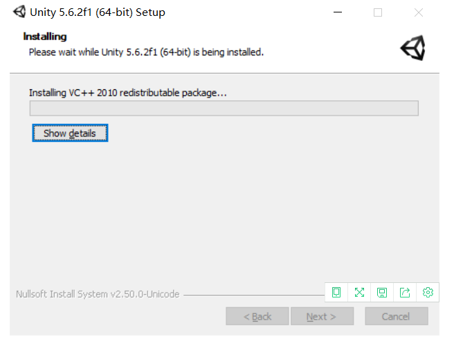
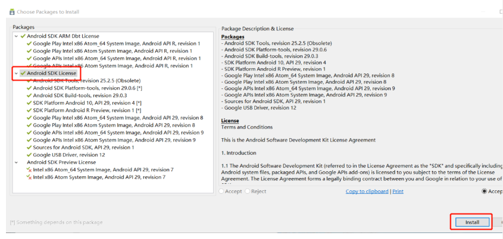
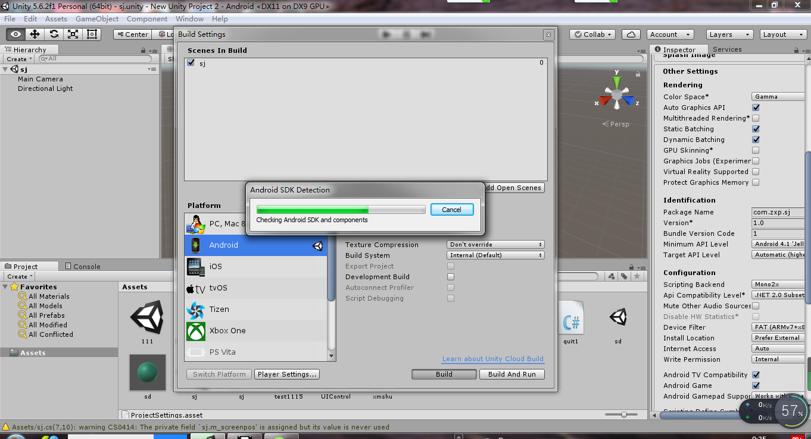

# 安装Unity&SDK&JDK教程
##### 由于视频大小超过25m无法直接上传至仓库，故附上百度网盘链接
- 以下步骤成功完成后生成apk操作的视频链接：链接：https://pan.baidu.com/s/1CT_onf5SVcEeFI5-5XRy9A    提取码：bzs8
##### 1. 安装Unity：UnitySetup64-5.6.2f1

- 2、修改路径，要预留较大的位置出来

- 3、一切确定完之后就可以进行安装。

- 4、注册登录登录Unity账号

- 5、打开Unity页面

##### 2. 安装安卓插件

- 完成安装。

#### 注：该插件的下载路径要与Unity的位置一样。不然在下载的开始的时候就会出现错误。
- 下载该插件，就可以支持发布页面的安卓选项。

##### 3. 安装Unity资源包
- 安装该资源包没什么需要注意的，一路向下即可。

##### 4、安装安卓的JDK

#### 注：请记得修改安装到的路径。

- 安装中

- 安装完成。

##### 5. 检查配置
- 在检查配置前，要先进行环境变量。
- 我的电脑--右键--属性--高级系统设置--环境变量。

 

- 用户变量--新建：JAVA_HOME；变量值：如图。
- 编辑--变量名"Path"--在原变量值最后添加%JAVA_HOME%\bin。

- 打开cmd,输入Java，出现以下结果，即证明没存在问题。

- 输入javac,若出现以下结果，这证明环境变量没问题。

##### 6.安装安卓的SDK置
- 解压红虚线框中的压缩包，安装。

- 运行SDK管理，进行资源更新

- 双击打开，按Install pakages安装包。选择Android SDK License，再按Install

##### 6.添加JDK和SDK的路径。--配置Unity3D的Android运行环境。

- 打开Unity3D--edit--preferences
#### 注：在选择JDK和SDK的路径的时候，千万记得要用英文的路径。要是存在中文，则会发生错误。

- 查看软件是否有安卓发布渠道。若出现如下图所示，则证明成功了。

##### 7、项目导出。
- Assets--Export Package...--在弹出窗口中，全选所有items，按Export.

##### 7.项目导入
- Assets-Import Package-Custom Package。全选所有items，然后按import。

#### 注意：所选择的文件的格式是package file.

##### 8、生成文件（生成apk为例子）
- file--build settings
- 按Add Open Scenes选择场景“sj”后，再按左下角的Swith Platform适配平台，再按Build，选择**路径（必须是英文，不能是中文）**
- 选择Android--Swich Platfrom--根据教程按Player Settings调设置
- 相对应的修改Company Name、Product Name和Package Name.(注意命名需要规范)

- 最后点击“build”，生成APK文件

