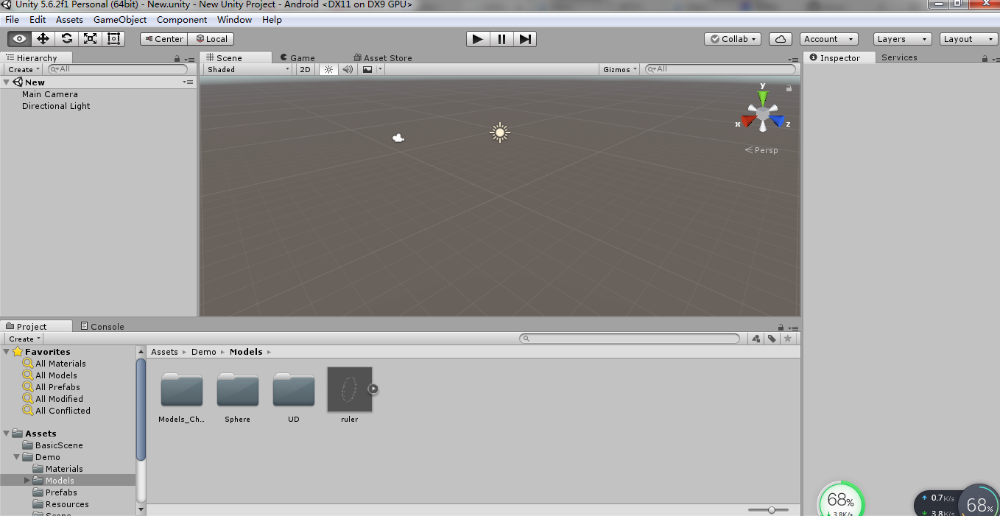

# 安装Unity&SDK&JDK教程
##### 1. 安装Unity

- 2、修改路径，要预留较大的位置出来

- 3、一切确定完之后就可以进行安装。

- 4、注册登录登录Unity账号

- 5、打开Unity页面

##### 2. 安装安卓插件

- 完成安装。

#### 注：该插件的下载路径要与Unity的位置一样。不然在下载的开始的时候就会出现错误。
- 下载该插件，就可以支持发布页面的安卓选项。

##### 3. 安装Unity资源包
- 安装该资源包没什么需要注意的，一路向下即可。

##### 4、安装安卓的JDK

#### 注：请记得修改安装到的路径。

- 安装中

- 安装完成。

##### 5. 检查配置
- 在检查配置前，要先进行环境变量。
- 我的电脑--右键--属性--高级系统设置--环境变量。
 
- 用户变量--新建：JAVA_HOME；变量值：如图。
- 编辑--变量名"Path"--在原变量值最后添加%JAVA_HOME%\bin。

- 打开cmd,输入Java，出现以下结果，即证明没存在问题。

- 输入javac,若出现以下结果，这证明环境变量没问题。

##### 6.安装安卓的SDK置
- 解压红虚线框中的压缩包，安装。

- 运行SDK管理，进行资源更新

- 双击打开，按Install pakages安装包。选择Android SDK License，再按Install

##### 6.添加JDK和SDK的路径。--配置Unity3D的Android运行环境。
- 打开Unity3D--edit--preferences
#### 注：在选择JDK和SDK的路径的时候，千万记得要用英文的路径。要是存在中文，则会发生错误。

- 查看软件是否有安卓发布渠道。若出现如下图所示，则证明成功了。

##### 7、项目导出。

##### 7.项目导出

